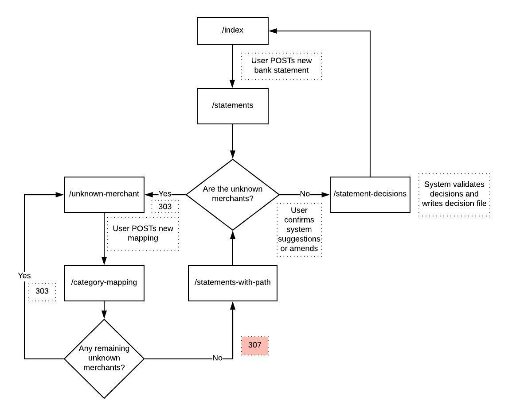

# Skrooge

### Work in progress
I chip away at this in waves, whether it is refactoring (usually) or adding features (occasionally). 

### Premise
A budgeting application to simplify and keep track of overcomplicated financial affairs. A user of this application might have several bank accounts and credit cards that they are regularly using. They want to budget expenditure over a year for several different categories of purchase, but find it hard to understand how they have spent their money.
Simply put this application allows the user to input normalised CSVs from several banks, an annual budget specified in JSON format, and categorise transactions on the CSVs. Categorisation suggestions are made, fairly crudely perhaps, by storing each categorisation and offering it again the next time the same merchant is seen.
Scripts are provided for several banks in order to normalise their CSV reports.
The back end provides an API serving a monthly report in JSON format. A basic frontend consumes data from this API and creates bar charts using [C3.js](https://c3js.org/).

I started writing this to keep track of my own affairs. I've learned about writing a larger Kotlin app from scratch, about the [HTTP4K](https://www.http4k.org/) library, testing strategies and a little about HTTP. As is par for the course, I've also learned a few lessons about what *not* to do.

### How do I run it?
There are numerous environment variables required in order to run the application. I may at one time provide documentation about these but currently, if you really want to build and run this app, you're on your own. I don't expect anyone to actually want to do this so if you really, really do, please contact me and we can talk about it. That aside, the app can be run as follows:

* Clone the repo
* Build the code and run: 
- *all* the tests: `./build-and-test.sh`
- only the backend: `./gradlew clean test`
- only the frontend: `./build-and-test-frontend.sh`
* Run it `./gradlew run`

### Testing
[HTTP4K](https://www.http4k.org/) is a library (some might say *framework*) that is demonstrably testable. An entire application can be started without a server (i.e. Jetty) and can be given `Request` objects to handle directly. This means lightning fast tests at an extremely high level without any need for spinning up a browser. Excited by this prospect, I began by attempting to drive all the functionality out by only writing tests at this high level, as an experiment to see how far I got. I was surprised at how far I got actually, though I found that the approach encouraged me to take shortcuts at a lower level that resulted in some fairly hairy code. Hopefully I've dealt with some of this, but I know there are plenty of gnarly quirks in there, aided by the fact that I hadn't really decided what I was building until quite a way in. 

Some way in I introduced some *approval* tests using [Okey-Doke](https://github.com/dmcg/okey-doke), a Java library that provides a fast, simple way to approve a document. The documents that I have approved have been both HTML and JSON output that the backend provides. I found that even a JSON API was able to be tested this way, provided that there is not too much data provided to begin with. Once the initial approval has been made, approving small changes (or preventing them if they were unintended) is easy.

### Back-end logic flowchart

